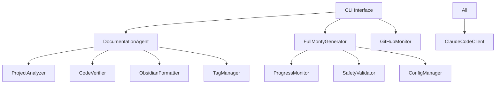

# DocuMentor - Intelligent Documentation Generator

## 🎯 Overview

DocuMentor is an advanced documentation generator that creates comprehensive, Obsidian-compatible documentation for any codebase. It features intelligent project analysis, code verification, safety validation, and continuous GitHub monitoring.

## 🚀 Quick Start - Configuring Local Folders

### Three Ways to Set Your Target Folder

**1. Default Configuration** (Persistent)
```bash
# Set default target path
documentor config --set-path ~/projects/my-project

# Set Obsidian vault path  
documentor config --set-vault ~/my-obsidian-vault/docs

# View current configuration
documentor config
```

**2. Command Line Override** (Single Run)
```bash
# Document specific folder
documentor generate ~/projects/my-app

# Document current directory
cd ~/projects/my-app
documentor generate .

# Use default from config
documentor generate  # Uses defaultTargetPath from config
```

**3. Edit Config Directly**
```bash
# Open config in editor
documentor config --edit

# Config location: ~/.documentor/config.json
# Change "defaultTargetPath" to your project folder
```

## ✨ Key Features

### Core Capabilities
- **🔍 Intelligent Project Analysis**: Automatically detects project types (monorepo, multi-tool, library)
- **✅ Code Verification**: Validates that documented functionality actually works
- **🔗 Obsidian Integration**: Full compatibility with backlinks, tags, and metadata
- **🔒 Safety Validation**: Prevents file corruption with automated backups
- **📊 Full Monty Mode**: Comprehensive analysis with quality scoring

### Advanced Features (v2.0)
- **📈 Progress Monitoring**: Real-time progress with interrupt capability (Ctrl+C, ESC)
- **⚙️ Auto-Configuration**: Self-generating config with templates
- **🛡️ Safety Validator**: Protected paths, checksums, sensitive data detection
- **🔍 GitHub Monitor**: Continuous repository tracking and commit documentation
- **📝 Self-Documentation**: Can document itself comprehensively

## 🏗️ Architecture

### Core Components



### Component Descriptions

| Component | Purpose | Key Features |
|-----------|---------|--------------|
| **DocumentationAgent** | Core documentation engine | Project analysis, code verification, formatting |
| **ConfigManager** | Configuration handling | Auto-generation, validation, templates |
| **ProgressMonitor** | Progress tracking | Real-time updates, interrupts, persistence |
| **SafetyValidator** | File safety | Backups, checksums, protected paths |
| **GitHubMonitor** | Repository monitoring | Commit tracking, analysis, documentation |
| **FullMontyGenerator** | Comprehensive docs | Quality scores, metrics, complete analysis |
| **ProjectAnalyzer** | Project detection | Type detection, structure analysis |
| **CodeVerifier** | Functionality validation | Entry points, tests, dependencies |
| **ObsidianFormatter** | Obsidian compatibility | Backlinks, tags, metadata |
| **TagManager** | Tag management | Hierarchy, reuse, statistics |

## 📁 Project Structure

```
docuMentor/
├── src/
│   ├── index.ts                 # CLI interface and commands
│   ├── DocumentationAgent.ts    # Core documentation engine
│   ├── ConfigManager.ts         # Configuration management
│   ├── ProgressMonitor.ts       # Progress tracking system
│   ├── SafetyValidator.ts       # Safety and integrity checks
│   ├── GitHubMonitor.ts         # GitHub integration
│   ├── FullMontyGenerator.ts    # Comprehensive generator
│   ├── ProjectAnalyzer.ts       # Project analysis
│   ├── CodeVerifier.ts          # Code verification
│   ├── ObsidianFormatter.ts     # Obsidian formatting
│   ├── TagManager.ts            # Tag management
│   └── claudeCodeClient.ts      # Claude SDK client
├── dist/                         # Compiled JavaScript
├── config/                       # Configuration files
├── package.json                  # Dependencies
├── tsconfig.json                 # TypeScript config
└── README.md                     # Documentation
```

## 🚀 Installation

### Prerequisites
- Node.js 16+ 
- Claude Code SDK subscription
- TypeScript 5.0+
- Git (for repository features)

### Setup

```bash
# Clone repository
git clone ~/github/docuMentor
cd ~/github/docuMentor

# Install dependencies
npm install

# Build project
npm run build

# Link globally
npm link

# Verify installation
documentor --version
```

## 📚 Commands

### Basic Commands

| Command | Description | Example |
|---------|-------------|---------|
| `generate` | Generate documentation | `documentor generate ~/project` |
| `verify` | Verify code functionality | `documentor verify ./src` |
| `analyze` | Analyze project structure | `documentor analyze .` |
| `tags` | Manage Obsidian tags | `documentor tags --scan` |

### Advanced Commands

| Command | Description | Example |
|---------|-------------|---------|
| `full-monty` | Comprehensive documentation | `documentor full-monty .` |
| `monitor` | GitHub monitoring | `documentor monitor --add owner/repo` |
| `config` | Manage configuration | `documentor config --show` |
| `safety` | Safety operations | `documentor safety --check .` |
| `self-document` | Document DocuMentor | `documentor self-document` |

### Command Options

#### Generate Command
```bash
documentor generate [path]
  -o, --output <path>     # Output location
  --no-verify             # Skip code verification
  --update                # Update existing docs
  -e, --exclude <paths>   # Exclude paths
```

#### Monitor Command
```bash
documentor monitor
  --add <repo>           # Add repository
  --remove <repo>        # Remove repository  
  --list                 # List repositories
  --start                # Start monitoring
  --interval <minutes>   # Poll interval
```

## ⚙️ Configuration

### Config Location
`~/.documentor/config.json`

### Configuration Structure

```json
{
  "defaultTargetPath": "/path/to/your/default/project",
  "obsidianVaultPath": "~/github/obsidian_vault/docs",
  "excludePaths": [
    "node_modules",
    ".git",
    "dist"
  ],
  "verifyCode": true,
  "generateBacklinks": true,
  "maxTags": 10,
  
  "safetyMode": {
    "enabled": true,
    "backupBeforeWrite": true,
    "validateJson": true,
    "maxFileSize": 10
  },
  
  "github": {
    "enabled": false,
    "accessToken": "ghp_YOUR_TOKEN_HERE",
    "username": "your-github-username",
    "repositories": ["owner/repo"],
    "pollInterval": 5,
    "documentOnCommit": true,
    "scopes": ["repo", "read:user", "read:project"]
  },
  
  "fullMonty": {
    "analyzeCode": true,
    "verifyFunctionality": true,
    "generateDiagrams": true,
    "analyzeSecurity": true
  }
}
```

## 🔒 Safety Features

### Protection Mechanisms
- **Automatic Backups**: Before any write operation
- **Checksum Verification**: File integrity monitoring
- **Protected Paths**: System directories protection
- **Sensitive Data Detection**: API keys, passwords, secrets
- **Validation**: JSON/YAML syntax checking
- **Size Limits**: Prevent oversized files

### Protected Paths
- System directories (`/System`, `/usr/bin`)
- User credentials (`~/.ssh`, `~/.aws`)
- Configuration files (`~/.gitconfig`, `~/.bashrc`)

## 📊 Full Monty Mode

### Comprehensive Analysis
Generates complete documentation including:

1. **Project Overview**: Purpose, features, structure
2. **Architecture Analysis**: Design patterns, components
3. **API Documentation**: Endpoints, schemas, examples
4. **Security Analysis**: Vulnerabilities, best practices
5. **Performance Analysis**: Bottlenecks, optimizations
6. **Dependency Analysis**: Versions, vulnerabilities
7. **Test Analysis**: Coverage, quality
8. **Code Metrics**: LOC, complexity, duplication
9. **Changelog**: Version history, migrations
10. **Diagrams**: Architecture, flow, ER diagrams

### Quality Scoring

| Metric | Description | Grade Scale |
|--------|-------------|-------------|
| **Code Quality** | Linting, formatting, practices | A+ (90-100) to F (<50) |
| **Documentation** | Coverage, completeness | A+ (90-100) to F (<50) |
| **Test Coverage** | Test suite completeness | A+ (90-100) to F (<50) |
| **Security Score** | Security best practices | A+ (90-100) to F (<50) |

## 🔍 GitHub Monitoring

### Features
- **Automatic Detection**: New commits detected via polling
- **Commit Analysis**: Detailed change documentation
- **File Tracking**: Changes with line-by-line analysis
- **Impact Assessment**: Breaking/major/minor/patch
- **Daily Summaries**: Aggregated commit reports

### GitHub Setup

1. **Generate Personal Access Token**:
   - Go to [GitHub Settings > Tokens](https://github.com/settings/tokens)
   - Click "Generate new token (classic)"
   - Select scopes: `repo`, `read:user`, `read:project`
   - Copy token (starts with `ghp_`)

2. **Configure DocuMentor**:
```bash
# Edit config to add token
documentor config --edit
# Set github.accessToken to your token
# Set github.enabled to true
```

3. **Monitor Repositories**:
```bash
# Add repository
documentor monitor --add facebook/react

# Start monitoring
documentor monitor --start --interval 5

# View status
documentor monitor --list
```

For detailed GitHub setup, see [[GITHUB_SETUP.md]]

## 🏷️ Tag System

### Intelligent Tagging
- **Automatic Detection**: Scans existing Obsidian tags
- **Hierarchy Management**: Project type, language, framework tags
- **Tag Reuse**: Prefers existing over new tags
- **Statistics**: Usage tracking and reporting

### Tag Categories
- **Project Types**: `monorepo`, `library`, `cli`, `web-app`
- **Languages**: `javascript`, `typescript`, `python`, `go`
- **Frameworks**: `react`, `vue`, `express`, `django`
- **Common**: `documentation`, `api`, `architecture`, `setup`

## 📈 Progress Monitoring

### Features
- **Real-time Updates**: Live progress display
- **Interrupt Handling**: Ctrl+C or ESC to interrupt
- **Progress Persistence**: Resume interrupted tasks
- **Auto-save**: Periodic state saving
- **Detailed Logging**: Complete operation history

### Progress Display
```
⚡ Analyzing Architecture     [████████░░░░░░░░░░░░░░░░░░░░] 27% | Finding components...
✅ Code Verification          [████████████████████████████] 100% | Complete
```

## 🛠️ Development

### Project Dependencies
```json
{
  "@anthropic-ai/claude-code": "^1.0.0",
  "commander": "^11.0.0"
}
```

### Build Process
```bash
# Development build
npm run dev

# Production build
npm run build

# Clean build
npm run clean && npm run build
```

### Testing
```bash
# Test on sample project
documentor generate ./test-project

# Full analysis
documentor full-monty ./test-project

# Verify functionality
documentor verify ./test-project
```

## 📝 Output Structure

### Documentation Layout
```
obsidian_vault/docs/
├── project-name/
│   ├── README.md           # Main documentation
│   ├── architecture.md     # System design
│   ├── api-reference.md    # API documentation
│   ├── security-analysis.md # Security review
│   ├── performance.md      # Performance analysis
│   ├── dependencies.md     # Dependency analysis
│   ├── test-analysis.md    # Test coverage
│   ├── metrics.md          # Code metrics
│   ├── CHANGELOG.md        # Version history
│   ├── diagrams.md         # Architecture diagrams
│   └── REPORT.md           # Full Monty report
├── commits/                 # GitHub commit tracking
│   └── repo_name/
│       └── date_sha_message.md
└── tag-index.md            # Tag reference
```

## 🚫 Automatic Exclusions

### Default Excluded Paths
- `~/github/docuMentor` (self)
- `~/github/obsidian_vault` (output)
- `node_modules/`
- `.git/`
- `dist/`, `build/`
- `.env*` files
- `secrets/`, `credentials/`

## 🎯 Use Cases

### 1. Project Onboarding
Generate comprehensive documentation for new team members:
```bash
documentor full-monty ~/projects/main-app
```

### 2. Code Audit
Verify and document working functionality:
```bash
documentor verify ~/projects/legacy-app
documentor generate ~/projects/legacy-app --verify
```

### 3. Continuous Documentation
Monitor repositories for changes:
```bash
documentor monitor --add myorg/myrepo --start
```

### 4. Knowledge Base
Build searchable documentation vault:
```bash
documentor generate ~/projects/* -o ~/obsidian/knowledge-base
```

## 🔮 Roadmap

### Planned Features
- [ ] Watch mode for real-time updates
- [ ] GitHub Actions integration
- [ ] Custom documentation templates
- [ ] Multi-language support
- [ ] Visual dependency graphs
- [ ] Documentation quality scoring
- [ ] API testing integration
- [ ] Collaborative features

## 📄 License

MIT License - See LICENSE file for details

## 🤝 Contributing

### Guidelines
1. Fork the repository
2. Create feature branch
3. Follow TypeScript best practices
4. Add tests for new features
5. Update documentation
6. Submit pull request

### Code Style
- TypeScript with strict mode
- ESLint configuration
- Prettier formatting
- Async/await patterns
- Comprehensive error handling

## 🆘 Troubleshooting

### Common Issues

| Issue | Solution |
|-------|----------|
| Config not found | Run `documentor config --reset` |
| Permission denied | Check safety validation: `documentor safety --check` |
| Interrupt not working | Ensure TTY mode or use `--no-interactive` |
| GitHub monitor fails | Verify access token in config |

## 📚 Related Documentation

### Configuration & Setup
- [[GITHUB_SETUP|GitHub Integration Setup]] - Complete GitHub authentication guide
- [[CONFIG|Configuration Reference]] - All configuration options
- [[obsidian/setup|Obsidian Setup]] - Vault configuration

### Technical Documentation
- [[docuMentor/architecture|Architecture Details]] - System design
- [[docuMentor/api|API Reference]] - API documentation
- [[docuMentor/changelog|Change History]] - Version history
- [[claude-code/sdk|Claude Code SDK]] - AI integration

---
*Generated by DocuMentor v2.0.0 - The Comprehensive Documentation Generator*