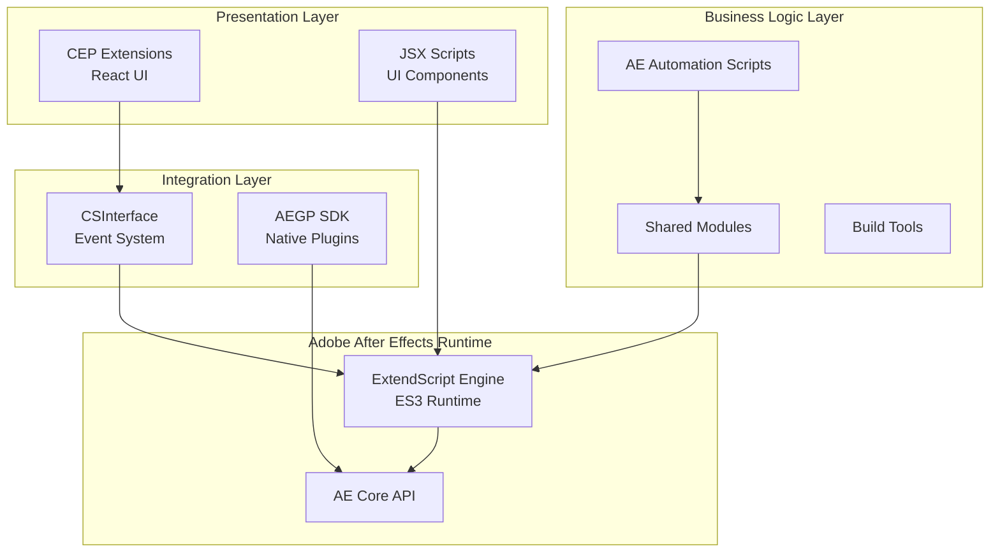
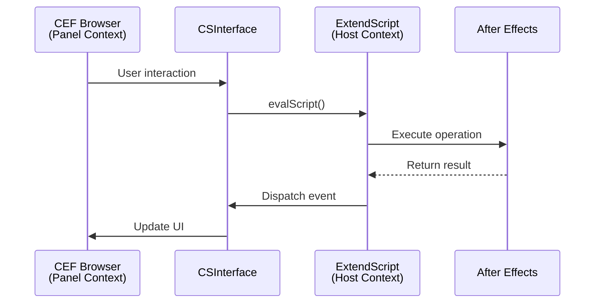
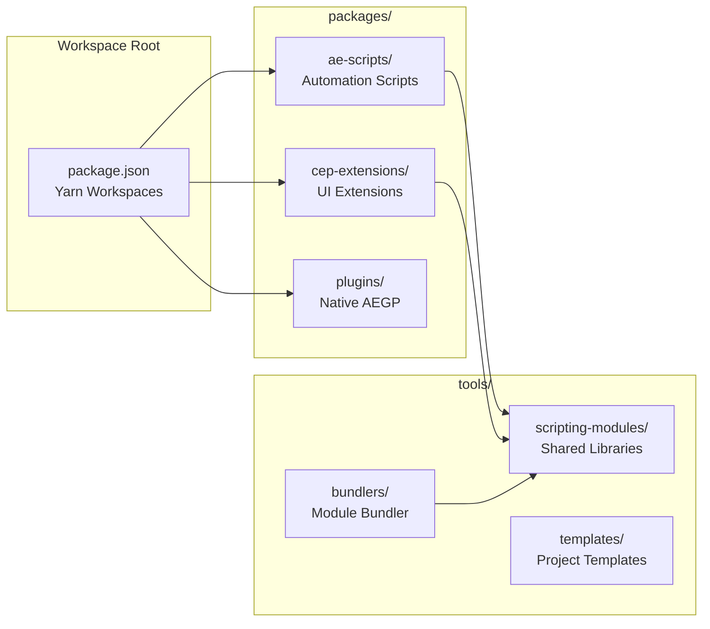
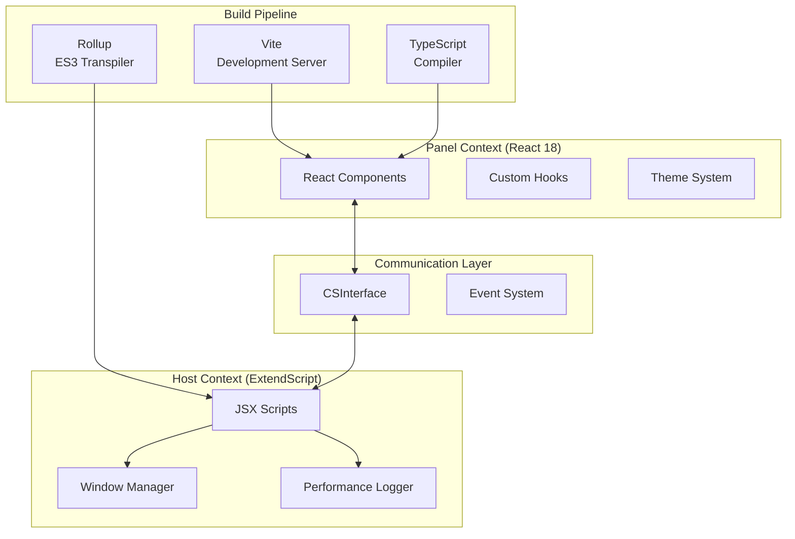
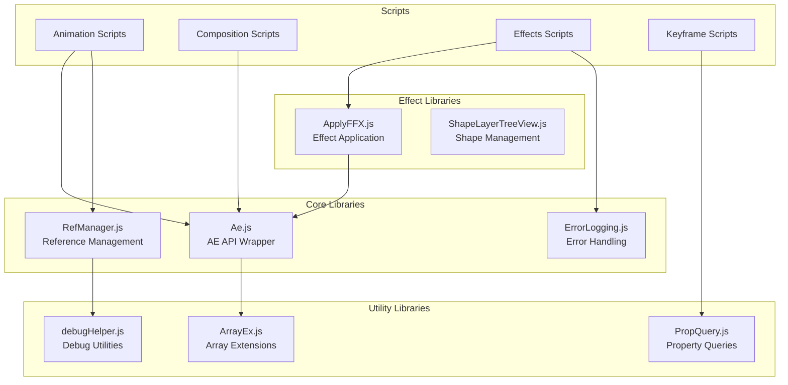
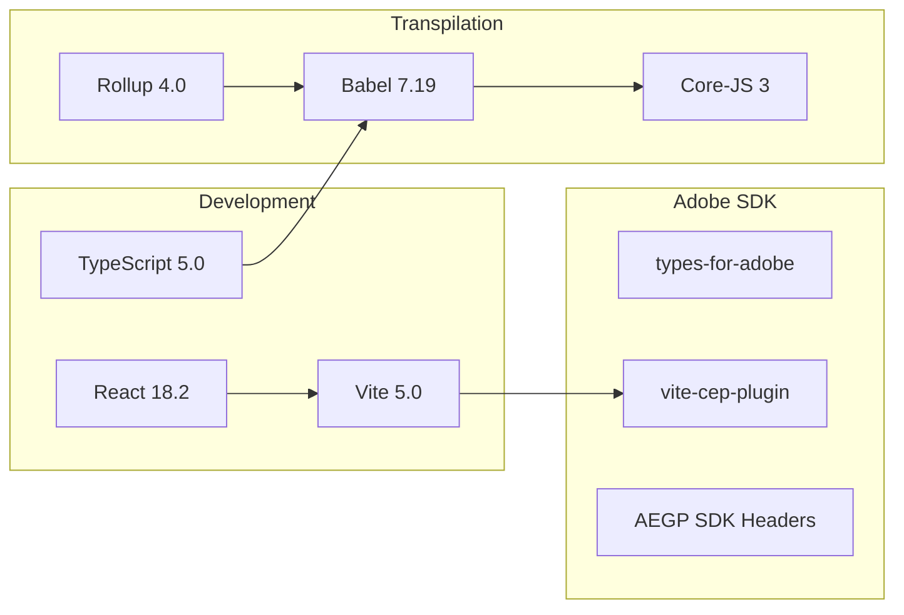
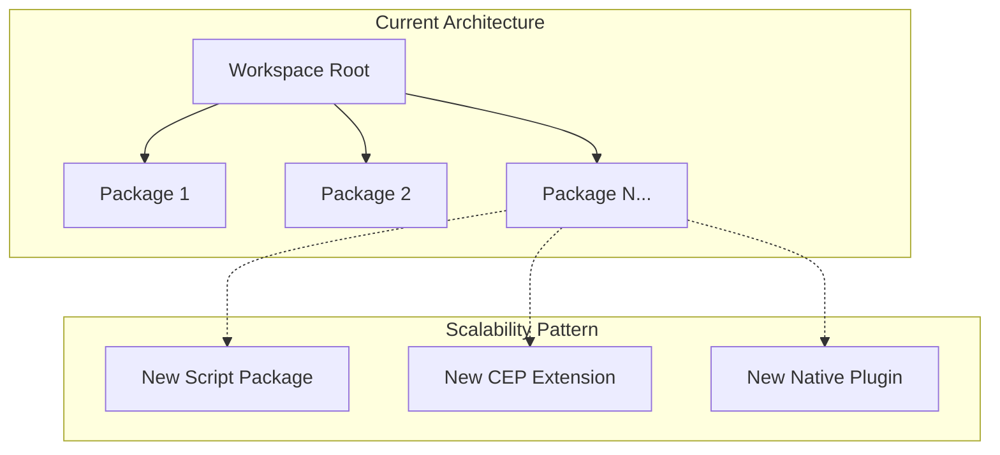
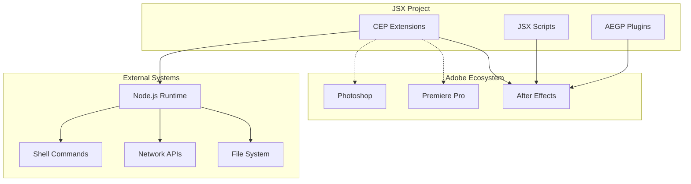
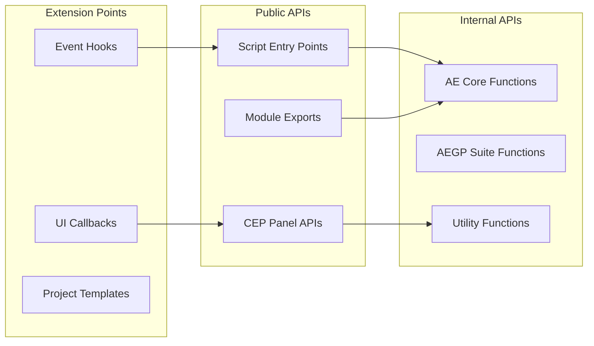

I'll analyze the architecture of the JSX project comprehensively. Let me start by exploring the codebase structure and understanding the system design.Let me explore more of the architecture to understand the system patterns and components better.# JSX Project Architecture Analysis

## 1. System Design Patterns

### **Layered Architecture**
The project follows a clear layered architecture with distinct separation of concerns:



### **Dual-Context Pattern (CEP Extensions)**
CEP extensions use a sophisticated dual-context architecture:



### **Module Pattern (ES3 Compatible)**
Due to ExtendScript's ES3 limitations, modules use IIFE pattern:

```javascript
// Module pattern used throughout
var ModuleName = (function() {
    var module = {};
    
    module.publicMethod = function() {
        // Implementation
    };
    
    return module;
})();
```

## 2. Component Relationships

### **Core Component Architecture**



### **Frame Navigator Extension Architecture**



## 3. Module Dependencies

### **Dependency Graph**



### **Build Dependencies**



## 4. Architectural Decisions

### **Technology Choices**

| Component | Technology | Rationale |
|-----------|------------|-----------|
| **UI Framework** | React 18 | Modern component-based UI with hooks support |
| **Build Tool** | Vite 5 | Fast HMR, native ES modules, excellent DX |
| **Language** | TypeScript 5 | Type safety, better IDE support, maintainability |
| **Module System** | Yarn Workspaces | Monorepo management, shared dependencies |
| **Transpiler** | Babel + Rollup | ES3 compatibility for ExtendScript |
| **Native Plugin** | AEGP SDK (C++) | Performance-critical operations, deeper AE integration |

### **Design Principles**

1. **Separation of Concerns**
   - Clear boundary between UI (React) and business logic (ExtendScript)
   - Modular script architecture with single-responsibility modules

2. **Progressive Enhancement**
   - Scripts work standalone, CEP extensions add enhanced UI
   - Native plugins for performance-critical features

3. **Backward Compatibility**
   - ES3 transpilation ensures compatibility with all AE versions
   - Version-agnostic CSInterface implementation

4. **Developer Experience**
   - Hot Module Replacement for rapid development
   - TypeScript for better tooling and error prevention
   - Automated build pipeline with Vite

## 5. Scalability Considerations

### **Horizontal Scalability**



### **Performance Optimization Strategies**

1. **Lazy Loading**
   - CEP extensions load JSX scripts on-demand
   - Module bundler includes only used functions

2. **Caching**
   - Performance timing cache for diagnostics
   - Module resolution cache in bundler

3. **Batch Operations**
   - Script operations batched with `app.beginUndoGroup()`
   - Event throttling in CEP communication layer

4. **Memory Management**
   - Explicit cleanup in native plugins
   - Reference counting in RefManager module

### **Scalability Limitations**

| Constraint | Impact | Mitigation |
|------------|--------|------------|
| **ES3 Runtime** | No modern JS features | Transpilation pipeline |
| **Single-threaded ExtendScript** | UI blocking on heavy ops | Native plugins for compute |
| **CSInterface overhead** | Communication latency | Event batching, caching |
| **AE API limitations** | Some operations unavailable | AEGP SDK for advanced features |

## 6. Integration Points

### **External Integration Architecture**



### **Integration Mechanisms**

1. **Adobe Creative Cloud**
   - CEP extensions run across CC applications
   - Shared manifests for multi-host support

2. **File System**
   - Project templates (.aep files)
   - Effect presets (.ffx files)
   - Configuration files (JSON)

3. **External Tools**
   - Git integration for version control
   - npm/yarn for dependency management
   - ZXP packaging for distribution

4. **Communication Protocols**
   - CSInterface events (internal)
   - JSON-based data exchange
   - Binary protocols for native plugins

### **API Surface**



## Summary

The JSX project demonstrates a sophisticated multi-layered architecture designed for Adobe After Effects automation and extension development. Key architectural strengths include:

- **Clean separation** between UI and business logic layers
- **Flexible module system** despite ES3 constraints  
- **Modern tooling** (React, TypeScript, Vite) with backward compatibility
- **Multiple integration patterns** (CEP, AEGP, standalone scripts)
- **Scalable monorepo structure** using Yarn workspaces

The architecture effectively balances modern development practices with the constraints of the Adobe ExtendScript environment, providing a robust foundation for building professional After Effects tools and workflows.


## Related Documents

Documents with similar tags:

- [[jsx/overview|Project Overview]] #overview #documentation #jsx #project-structure

