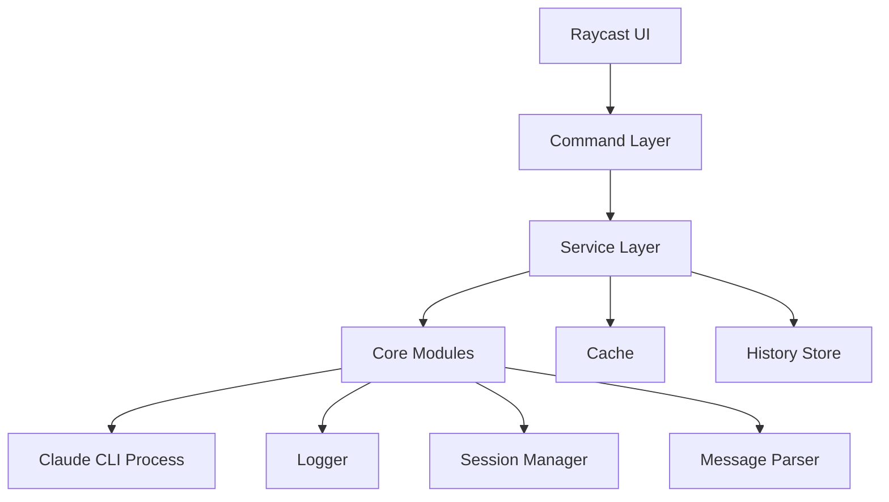

# ClaudeCast Implementation Guide

#raycast #claude #implementation #architecture #typescript #development-guide

> ⚠️ **NOTE**: This guide reflects the original plan. For actual implementation status, see [[CURRENT_STATE]].

## Overview

This guide provides detailed implementation instructions for the ClaudeCast Raycast extension, including architecture decisions, code patterns, and development workflows.

## Architecture Overview

### Design Principles

1. **Modular Architecture** - Single responsibility, clear interfaces
2. **Defensive Logging** - Comprehensive logging from inception
3. **Test-Driven Development** - Tests alongside implementation
4. **Error Resilience** - Graceful degradation and recovery
5. **Type Safety** - Full TypeScript with strict mode

### System Architecture



## Module Implementation

### 1. Logger System ✅ (Completed)

**Location**: `src/core/logger/`

**Implementation Details**:
```typescript
// Multi-transport logging
const logger = createLogger('module-name', {
  transports: [
    new ConsoleTransport(),
    new FileTransport({ 
      dir: '~/.claudecast/logs',
      maxSize: 10MB,
      maxFiles: 5 
    }),
    new RaycastTransport({ showToasts: true })
  ]
});
```

**Features**:
- Structured JSON logging
- Correlation IDs
- Performance timers
- Circular buffer
- Auto-rotation
- Privacy filtering

### 2. Process Manager 🚧 (In Progress)

**Location**: `src/core/claude-cli/process-manager.ts`

**Implementation Plan**:
```typescript
export class ProcessManager {
  private process: ExecaChildProcess | null = null;
  private restartCount = 0;
  private maxRestarts = 3;
  
  async spawn(command: string, args: string[]): Promise<void> {
    // Implementation with:
    // - Health monitoring
    // - Automatic restart on crash
    // - Stream management
    // - Graceful shutdown
  }
}
```

**Key Considerations**:
- Use `execa` for process spawning
- Implement exponential backoff for restarts
- Buffer output to prevent memory issues
- Handle SIGTERM gracefully

### 3. Message Parser 📋 (Planned)

**Location**: `src/core/claude-cli/message-parser.ts`

**Design**:
```typescript
export class MessageParser {
  private buffer = '';
  
  parseChunk(chunk: string): ParsedMessage[] {
    // Handle:
    // - Streaming chunks
    // - ANSI escape codes
    // - Partial messages
    // - Error formats
  }
}
```

**Parsing Strategy**:
- Buffer incomplete messages
- Strip ANSI codes for display
- Detect message boundaries
- Extract metadata (timestamps, types)

### 4. Session Manager 📋 (Planned)

**Location**: `src/core/claude-cli/session-manager.ts`

**Architecture**:
```typescript
export class SessionManager {
  private sessions: Map<string, Session> = new Map();
  
  async createSession(id: string): Promise<Session> {
    // Create new conversation session
  }
  
  async persistSession(session: Session): Promise<void> {
    // Save to disk for recovery
  }
  
  async recoverSession(id: string): Promise<Session> {
    // Restore from disk
  }
}
```

## UI Implementation

### Command Structure

#### Chat Command
**File**: `src/chat.tsx`

```tsx
export default function ChatCommand() {
  const [messages, setMessages] = useState<Message[]>([]);
  const [input, setInput] = useState('');
  
  return (
    <Detail
      markdown={formatMessages(messages)}
      actions={
        <ActionPanel>
          <Action.SubmitForm onSubmit={sendMessage} />
        </ActionPanel>
      }
    />
  );
}
```

#### Quick Ask Command
**File**: `src/quick-ask.tsx`

```tsx
export default function QuickAskCommand() {
  return (
    <Form
      actions={
        <ActionPanel>
          <Action.SubmitForm
            title="Ask Claude"
            onSubmit={handleQuickAsk}
          />
        </ActionPanel>
      }
    >
      <Form.TextArea id="question" title="Question" />
    </Form>
  );
}
```

## Development Workflow

### 1. Setup Development Environment

```bash
# Install dependencies
npm install

# Start development mode
npm run dev

# In another terminal, run tests
npm test:watch
```

### 2. Testing Workflow

#### Unit Testing
```typescript
// Example test structure
describe('ProcessManager', () => {
  it('should spawn process successfully', async () => {
    const manager = new ProcessManager();
    await expect(manager.spawn('claude', [])).resolves.not.toThrow();
  });
});
```

#### Integration Testing
```typescript
// Test module interactions
describe('Claude Service Integration', () => {
  it('should handle full conversation flow', async () => {
    // Test complete workflow
  });
});
```

### 3. Debugging

#### Using the Logger
```typescript
logger.debug('Starting operation', { userId, sessionId });
logger.time('api-call');
// ... operation
logger.timeEnd('api-call');
```

#### Debug Command
Access via Raycast: "Debug Logs" command shows:
- Recent log entries
- Performance metrics
- Error traces
- System state

## State Management

### Conversation State
```typescript
interface ConversationState {
  id: string;
  messages: Message[];
  context: ConversationContext;
  metadata: {
    created: Date;
    updated: Date;
    model: string;
  };
}
```

### Persistence Strategy
- Use localStorage for temporary state
- File system for long-term storage
- JSON format for portability

## Error Handling

### Error Categories

1. **Process Errors**
   - CLI not found
   - Process crash
   - Timeout

2. **Parsing Errors**
   - Invalid response format
   - Incomplete messages
   - Encoding issues

3. **UI Errors**
   - Rendering failures
   - Action failures
   - State corruption

### Error Recovery

```typescript
class ErrorRecovery {
  async handleError(error: Error, context: ErrorContext) {
    // Log error with context
    logger.error('Operation failed', error, context);
    
    // Attempt recovery based on error type
    switch(error.type) {
      case 'PROCESS_CRASH':
        await this.restartProcess();
        break;
      case 'PARSE_ERROR':
        await this.clearBufferAndRetry();
        break;
      default:
        await this.showUserError(error);
    }
  }
}
```

## Performance Optimization

### Strategies

1. **Lazy Loading**
   - Load modules on demand
   - Defer non-critical operations

2. **Caching**
   - Cache Claude responses
   - Store processed messages
   - Memoize expensive operations

3. **Stream Processing**
   - Process responses incrementally
   - Update UI progressively
   - Avoid blocking operations

### Performance Monitoring

```typescript
// Track operation timing
const timer = logger.startTimer('operation');
// ... perform operation
timer(); // Logs elapsed time

// Monitor memory usage
logger.info('Memory usage', {
  heap: process.memoryUsage().heapUsed,
  rss: process.memoryUsage().rss
});
```

## Build & Deploy

### Production Build

```bash
# Run tests
npm test

# Type check
npm run typecheck

# Lint
npm run lint

# Build
npm run build

# Package for distribution
ray build -e dist
```

### Pre-release Checklist

- [ ] All tests passing
- [ ] Type checking clean
- [ ] Linting passed
- [ ] Documentation updated
- [ ] CHANGELOG updated
- [ ] Version bumped
- [ ] Manual testing completed

## Troubleshooting Guide

### Common Development Issues

#### TypeScript Errors
```bash
# Clear TypeScript cache
rm -rf node_modules/.cache/typescript

# Reinstall types
npm install --save-dev @types/node @types/react
```

#### Raycast Not Updating
```bash
# Clear Raycast cache
ray clear-cache

# Restart development
npm run dev
```

#### Test Failures
```bash
# Run single test file
npm test -- process-manager.test.ts

# Debug test
npm test -- --inspect-brk
```

## Code Style Guide

### TypeScript Conventions
- Use strict mode
- Prefer interfaces over types
- Explicit return types
- No any types

### React Patterns
- Functional components
- Custom hooks for logic
- Memoization where needed
- Error boundaries

### File Organization
```
feature/
├── index.ts         # Public exports
├── types.ts         # Type definitions
├── component.tsx    # React component
├── hook.ts         # Custom hook
└── utils.ts        # Helper functions
```

## Security Considerations

### Data Privacy
- Never log sensitive data
- Sanitize user input
- Encrypt stored sessions
- Clear memory after use

### Process Security
- Validate CLI commands
- Sandbox process execution
- Limit resource usage
- Handle injection attacks

## Future Enhancements

### Planned Features
1. Multi-model support
2. Conversation branching
3. Export functionality
4. Custom shortcuts
5. Theme support

### Architecture Evolution
- Plugin system for extensions
- WebSocket for real-time updates
- Cloud sync for settings
- Collaborative features

## Resources

### Internal Documentation
- [[CURRENT_STATE]] ⭐ - **Accurate current implementation**
- [[README]] - Project overview
- [[CHANGELOG]] - Version history
- [[ARCHITECTURE]] - System design

### External Resources
- [Raycast API Docs](https://developers.raycast.com)
- [Claude Code CLI](https://github.com/anthropics/claude-code)
- [TypeScript Handbook](https://www.typescriptlang.org/docs/)
- [React Documentation](https://react.dev)

## Support

### Getting Help
1. Check debug logs: `~/.claudecast/logs/`
2. Use Debug command in Raycast
3. Review error messages
4. Check known issues in CHANGELOG

### Reporting Issues
- Include log files
- Provide reproduction steps
- Note system configuration
- Attach relevant code snippets