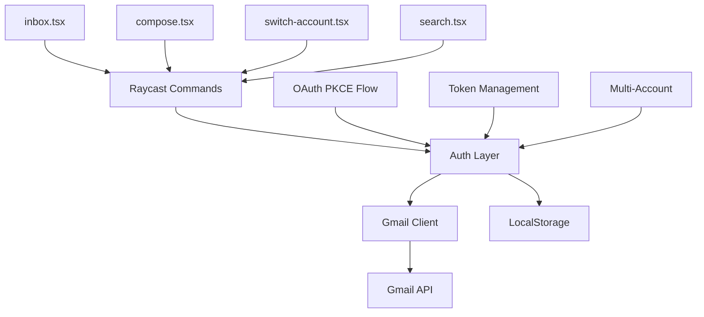

# rCastGmail - Implementation Guide & Next Steps

#raycast #gmail #implementation #oauth #guide

**Date:** 2025-08-27
**Author:** Analysis via Claude

## Quick Start Guide

### Option 1: Automated Setup (Recommended)
```bash
cd ~/github/rCastGmail
./auto-setup-oauth.sh
# Follow the interactive prompts
npm run dev
```

### Option 2: Manual OAuth Setup

#### Step 1: Google Cloud Console
1. Visit https://console.cloud.google.com
2. Create new project or select existing
3. Navigate to **APIs & Services** → **Library**
4. Search and enable **Gmail API**

#### Step 2: Create OAuth Credentials
1. Go to **APIs & Services** → **Credentials**
2. Click **CREATE CREDENTIALS** → **OAuth client ID**
3. Choose **Desktop app** as application type
4. Name: "Raycast Gmail"
5. Copy the generated Client ID

#### Step 3: Configure Extension
```typescript
// Edit src/lib/auth.ts line 22
const clientId = "YOUR_ACTUAL_CLIENT_ID.apps.googleusercontent.com";
```

#### Step 4: Test
```bash
npm run dev
# Open Raycast → Search "Gmail"
```

## Implementation Analysis

### Current Architecture



### Code Flow Analysis

#### Authentication Flow
```typescript
// Current implementation in auth.ts
1. User triggers command
2. Check for stored tokens
3. If expired, refresh
4. If none, initiate OAuth:
   - Generate PKCE challenge
   - Open browser for consent
   - Exchange code for tokens
   - Store in LocalStorage
5. Return valid access token
```

#### Data Flow
```typescript
// inbox.tsx flow
useEffect → loadEmails() → auth.authorize() → 
GmailClient → listMessages() → setState → render
```

## Discovered Issues & Solutions

### 1. Missing OAuth Configuration
**Issue**: Client ID placeholder not replaced
**Impact**: Extension non-functional
**Solution**: 
```bash
# Quick fix
export GOOGLE_CLIENT_ID="your-id.apps.googleusercontent.com"
# Then in code, update to use env var
```

### 2. Reply Feature Not Implemented
**Current Code** (inbox.tsx:238):
```typescript
onAction={() => {
  showToast({ title: "Reply feature coming soon" });
}}
```

**Proposed Implementation**:
```typescript
onAction={() => {
  // Open compose with pre-filled reply context
  launchCommand({
    name: "compose",
    type: LaunchType.UserInitiated,
    context: {
      replyTo: email.id,
      to: email.from,
      subject: `Re: ${email.subject}`,
      threadId: email.threadId
    }
  });
}}
```

### 3. Draft Saving Incomplete
**Current**: Placeholder implementation
**Solution**: Implement using Gmail API drafts endpoint
```typescript
async function saveDraft(values: ComposeFormValues) {
  const tokens = await auth.authorize();
  const client = new GmailClient(tokens.accessToken);
  await client.createDraft(
    values.to,
    values.subject,
    values.body
  );
}
```

### 4. Environment Variable Support Missing
**Issue**: Client ID hardcoded
**Solution**: Add dotenv support
```json
// package.json
"dependencies": {
  "dotenv": "^16.3.1"
}
```
```typescript
// auth.ts
import dotenv from 'dotenv';
dotenv.config();
const clientId = process.env.GOOGLE_CLIENT_ID || "fallback";
```

## Performance Optimizations

### 1. Email Caching
```typescript
// Add to gmail-client.ts
private cache = new Map<string, EmailSummary[]>();
private cacheTimeout = 5 * 60 * 1000; // 5 minutes

async listMessages(query?: string): Promise<EmailSummary[]> {
  const cacheKey = query || 'inbox';
  const cached = this.cache.get(cacheKey);
  if (cached && Date.now() - cached.timestamp < this.cacheTimeout) {
    return cached.data;
  }
  // ... fetch and cache
}
```

### 2. Batch Operations
```typescript
// Optimize multiple mark as read
async markMultipleAsRead(messageIds: string[]): Promise<void> {
  const batch = messageIds.map(id => ({
    method: 'POST',
    path: `/gmail/v1/users/me/messages/${id}/modify`,
    body: { removeLabelIds: ['UNREAD'] }
  }));
  await this.batchRequest(batch);
}
```

## Security Enhancements

### 1. Token Encryption
```typescript
// Add encryption for stored tokens
import crypto from 'crypto';

class SecureStorage {
  private encrypt(text: string): string {
    const cipher = crypto.createCipher('aes-256-gcm', 'raycast-key');
    return cipher.update(text, 'utf8', 'hex') + cipher.final('hex');
  }
  
  private decrypt(text: string): string {
    const decipher = crypto.createDecipher('aes-256-gcm', 'raycast-key');
    return decipher.update(text, 'hex', 'utf8') + decipher.final('utf8');
  }
}
```

### 2. Scope Minimization
```typescript
// Current scopes might be too broad
// Minimize to only required:
scope: [
  "https://www.googleapis.com/auth/gmail.readonly",
  "https://www.googleapis.com/auth/gmail.send"
  // Remove gmail.compose if not using drafts
]
```

## Deployment Strategies

### For Individual Developers
1. Fork the repository
2. Configure personal OAuth
3. Use `npm run dev` for development
4. Build with `npm run build`

### For Companies (Workspace)
```bash
# Use internal OAuth setup
./setup-internal.sh

# This creates a zero-config package for employees
# Employees just unzip and run, no OAuth setup needed
```

### For Public Distribution
1. Create verified Google Cloud project
2. Submit for OAuth verification
3. Publish to Raycast Store:
```bash
npm run publish
```

## Testing Strategy

### Unit Tests (Missing - Recommended)
```typescript
// Add tests for critical functions
describe('GmailClient', () => {
  test('parseMessage extracts headers correctly', () => {
    const message = createMockMessage();
    const summary = client.messageToSummary(message);
    expect(summary.from).toBe('sender@example.com');
  });
});
```

### Integration Tests
```bash
# Create test script
npm run test:integration

# Should test:
- OAuth flow
- API calls with mock server
- Token refresh
- Error handling
```

## Feature Roadmap

### Phase 1: Core Fixes (1-2 days)
- [ ] Configure OAuth Client ID
- [ ] Add environment variable support
- [ ] Implement reply functionality
- [ ] Add draft saving

### Phase 2: Enhancements (3-5 days)
- [ ] Email threading view
- [ ] Label management
- [ ] Filter/folder support
- [ ] Attachment handling
- [ ] Batch operations

### Phase 3: Advanced (1 week)
- [ ] Smart compose with AI
- [ ] Email templates
- [ ] Scheduled sending
- [ ] Priority inbox
- [ ] Vacation responder control

### Phase 4: Enterprise (2 weeks)
- [ ] Shared mailbox support
- [ ] Delegation management
- [ ] Admin console integration
- [ ] Audit logging
- [ ] Compliance features

## Monitoring & Debugging

### Enable Debug Logging
```typescript
// Add to auth.ts
const DEBUG = process.env.DEBUG === 'true';

function log(...args: any[]) {
  if (DEBUG) console.log('[Gmail]', ...args);
}
```

### Error Tracking
```typescript
// Add error reporting
import * as Sentry from '@sentry/node';

Sentry.init({
  dsn: process.env.SENTRY_DSN,
  environment: 'development'
});

// Wrap API calls
try {
  await apiCall();
} catch (error) {
  Sentry.captureException(error);
  throw error;
}
```

## Conclusion

The rCastGmail extension is **well-architected** and **nearly complete**, requiring only OAuth configuration to become functional. The codebase shows professional structure with good separation of concerns and comprehensive error handling.

**Immediate Priority**: Run `./auto-setup-oauth.sh` or manually configure OAuth Client ID to make the extension functional.

**Time to Production**: 
- Basic functionality: 30 minutes (just OAuth setup)
- Full features: 1-2 weeks
- Enterprise ready: 3-4 weeks

## Commands Quick Reference

```bash
# Development
npm run dev          # Start development mode
npm run build       # Build for production
npm run lint        # Check code style
npm run fix-lint    # Fix style issues

# Deployment
./auto-setup-oauth.sh    # Automated Google setup
./setup-internal.sh      # Internal company deployment
npm run publish          # Publish to Raycast Store

# Testing
npm test                 # Run tests (when added)
```

## Related Files

- [[PROJECT_STATUS]] - Current state analysis
- [[ARCHITECTURE_NOTES]] - Technical architecture details
- `/Users/ivg/github/rCastGmail/INTERNAL_SETUP.md` - Company setup guide
- `/Users/ivg/github/rCastGmail/auto-setup-oauth.sh` - Automation script