## Table of Contents

1. [Executive Summary](#executive-summary)

2. [System Architecture](#system-architecture)

3. [Technology Stack](#technology-stack)

4. [Repository Structure](#repository-structure)

5. [Authentication & User Management](#authentication--user-management)

6. [Animation Management System](#animation-management-system)

7. [Deployment Pipeline](#deployment-pipeline)

8. [Data Persistence Layer](#data-persistence-layer)

9. [Environment Strategy](#environment-strategy)

10. [Security Model](#security-model)

11. [Development Workflow](#development-workflow)

12. [Implementation Roadmap](#implementation-roadmap)

  

---

  

## Executive Summary

  

### Purpose

Rive Preview is a professional animation preview platform that enables designers and developers to:

- Preview and test Rive animations in a controlled environment

- Customize CSS styling with persistence across sessions

- Share animations within teams (work mode) or manage personal collections

- Deploy animations with consistent metadata and organization

  

### Core Philosophy

**Separation of Concerns with Unified Experience**: Development happens in isolation (rive-preview repo), deployment serves users (forge platform), but the experience remains seamless.

  

---

  

## System Architecture

  

### High-Level Architecture

```mermaid

%%{init: {'theme':'dark', 'themeVariables': { 'primaryColor':'#1f2937', 'primaryTextColor':'#f3f4f6', 'primaryBorderColor':'#60a5fa', 'lineColor':'#60a5fa', 'secondaryColor':'#374151', 'tertiaryColor':'#1f2937', 'background':'#111827', 'mainBkg':'#1f2937', 'secondBkg':'#374151', 'fontFamily':'monospace'}}}%%

graph TB

Users["👥 USERS"]:::userNode

Forge["🌐 forge.mograph.life<br/>(Vercel Deployment)"]:::deployNode

Prod["📦 Production<br/>forge.mograph.life"]:::envNode

Stage["🧪 Staging<br/>staging.forge.mograph.life"]:::envNode

RivePreview["📁 rive-preview<br/>(Private Source Repo)"]:::sourceNode

Clerk["🔐 Clerk<br/>(Authentication)"]:::serviceNode

Supabase["💾 Supabase<br/>(Database)"]:::serviceNode

CDN["⚡ CDN<br/>(Static Assets)"]:::serviceNode

Users -->|"HTTPS"| Forge

Forge --> Prod

Forge --> Stage

Prod --> RivePreview

Stage --> RivePreview

RivePreview --> Clerk

RivePreview --> Supabase

RivePreview --> CDN

classDef userNode fill:#10b981,stroke:#34d399,stroke-width:2px,color:#000

classDef deployNode fill:#3b82f6,stroke:#60a5fa,stroke-width:2px,color:#fff

classDef envNode fill:#8b5cf6,stroke:#a78bfa,stroke-width:2px,color:#fff

classDef sourceNode fill:#f59e0b,stroke:#fbbf24,stroke-width:2px,color:#000

classDef serviceNode fill:#6366f1,stroke:#818cf8,stroke-width:2px,color:#fff

```

  



  

### Component Interaction Flow

  


  

---

  

## Technology Stack

  

### Core Technologies

  

| Component | Technology | Purpose | Why This Choice |

|-----------|------------|---------|-----------------|

| **Frontend** | Vanilla JS + CSS | Interactive UI | No build step, instant updates, maximum compatibility |

| **Animation** | Rive Runtime | Animation rendering | Industry-standard, performant, feature-rich |

| **Authentication** | Clerk | User management | Seamless JWT integration, excellent DX, multi-provider support |

| **Database** | Supabase | Data persistence | PostgreSQL power, real-time capabilities, Row Level Security |

| **Deployment** | Vercel | Static hosting | Edge network, instant deployments, excellent Git integration |

| **Version Control** | GitHub | Source management | Actions for CI/CD, secrets management, collaboration |

  

### Integration Points

```mermaid

%%{init: {'theme':'dark', 'themeVariables': { 'primaryColor':'#1f2937', 'primaryTextColor':'#f3f4f6', 'primaryBorderColor':'#60a5fa', 'lineColor':'#60a5fa', 'secondaryColor':'#374151', 'background':'#111827'}}}%%

graph LR

Clerk["🔐 Clerk"]:::authNode

Supabase["💾 Supabase"]:::dbNode

App["📱 App Logic"]:::appNode

GitHub["🐙 GitHub"]:::gitNode

Vercel["▲ Vercel"]:::deployNode

Forge["🌐 Forge Repo"]:::forgeNode

Clerk -->|"JWT Token"| Supabase

Clerk -->|"User ID"| App

GitHub -->|"Webhook"| Vercel

GitHub -->|"Action"| Forge

classDef authNode fill:#10b981,stroke:#34d399,stroke-width:2px,color:#000

classDef dbNode fill:#3b82f6,stroke:#60a5fa,stroke-width:2px,color:#fff

classDef appNode fill:#f59e0b,stroke:#fbbf24,stroke-width:2px,color:#000

classDef gitNode fill:#6366f1,stroke:#818cf8,stroke-width:2px,color:#fff

classDef deployNode fill:#8b5cf6,stroke:#a78bfa,stroke-width:2px,color:#fff

classDef forgeNode fill:#ec4899,stroke:#f472b6,stroke-width:2px,color:#fff

```

  



  

---

  

## Repository Structure

  

### Rive-Preview Repository (Source of Truth)

  


  

### Forge Repository (Deployment Target)

  

```

forge/

├── apps/

│ └── rive-preview/

│ ├── production/ # Main branch deployment

│ └── staging/ # Staging branch deployment

└── vercel.json # Root routing rules

```

  

---

  

## Authentication & User Management

  

### Authentication Flow

  


  

### User Modes

```mermaid

%%{init: {'theme':'dark', 'themeVariables': { 'primaryColor':'#1f2937', 'primaryTextColor':'#f3f4f6', 'primaryBorderColor':'#60a5fa', 'lineColor':'#60a5fa'}}}%%

graph LR

Toggle[Toggle Switch]:::toggleNode

Work[Work Mode]:::workNode

Personal[Personal Mode]:::personalNode

WorkFeatures[["• Shared animations<br/>• Repo storage<br/>• Team metadata<br/>• Nested folders"]]:::featureNode

PersonalFeatures[["• Private uploads<br/>• Supabase storage<br/>• Personal library<br/>• CRUD operations"]]:::featureNode

Toggle --> Work

Toggle --> Personal

Work --> WorkFeatures

Personal --> PersonalFeatures

classDef toggleNode fill:#f59e0b,stroke:#fbbf24,stroke-width:2px,color:#000

classDef workNode fill:#3b82f6,stroke:#60a5fa,stroke-width:2px,color:#fff

classDef personalNode fill:#10b981,stroke:#34d399,stroke-width:2px,color:#000

classDef featureNode fill:#374151,stroke:#6b7280,stroke-width:1px,color:#f3f4f6

```

  



  

#### Work Mode (Default)

- Access to shared organizational animations

- Animations stored in repo (`/animations` folder)

- Metadata from centralized `metadata.json`

- CSS settings private per user

- Ideal for team collaboration

  

#### Personal Mode

- Access to user-uploaded animations

- Animations stored in Supabase Storage

- Metadata stored with animation record

- Full CRUD operations

- Ideal for individual experimentation

  

---

  

## Animation Management System

  

### Animation Lifecycle

  


  

### Metadata Schema

  

```json

{

"filename.riv": {

"description": "Human-readable description",

"category": "ui|physics|character|effects",

"tags": ["tag1", "tag2"],

"author": "username",

"date_added": "ISO-8601",

"last_modified": "ISO-8601",

"preview_url": "optional-thumbnail",

"settings": {

"default_state": "state-name",

"autoplay": true,

"loop": true

}

}

}

```

  

### Metadata Enforcement Flow

  


  

---

  

## Deployment Pipeline

  

### Branch Strategy

  


  

### Deployment Flow

  


  

### Why This Architecture?

  

1. **Separation**: Development isolated from deployment

2. **Security**: Private development, public serving

3. **Flexibility**: Multiple apps can live in forge

4. **Simplicity**: No complex build process

5. **Speed**: Direct file serving, no server processing

  

---

  

## Data Persistence Layer

  

### Database Schema

  


  

### Row Level Security (RLS) Policies

```mermaid

%%{init: {'theme':'dark', 'themeVariables': { 'primaryColor':'#1f2937', 'primaryTextColor':'#f3f4f6', 'primaryBorderColor':'#60a5fa', 'lineColor':'#60a5fa'}}}%%

graph TB

Request[Database Request]:::requestNode

CheckJWT{Valid JWT?}:::decisionNode

CheckUser{User ID Match?}:::decisionNode

CheckAdmin{Is Admin?}:::decisionNode

Allow[✅ Allow]:::allowNode

Deny[❌ Deny]:::denyNode

Request --> CheckJWT

CheckJWT -->|No| Deny

CheckJWT -->|Yes| CheckUser

CheckUser -->|Yes| Allow

CheckUser -->|No| CheckAdmin

CheckAdmin -->|Yes| Allow

CheckAdmin -->|No| Deny

classDef requestNode fill:#3b82f6,stroke:#60a5fa,stroke-width:2px,color:#fff

classDef decisionNode fill:#f59e0b,stroke:#fbbf24,stroke-width:2px,color:#000

classDef allowNode fill:#10b981,stroke:#34d399,stroke-width:2px,color:#000

classDef denyNode fill:#ef4444,stroke:#f87171,stroke-width:2px,color:#fff

```

  



  

### Storage Buckets

  

```

user-animations/

├── {user_id}/

│ ├── animation1.riv

│ └── animation2.riv

```

  

---

  

## Environment Strategy

  

### Environment Configuration Flow

  


  

### Environment Configuration

  

| Environment | Purpose | Supabase | Clerk | Domain |

|------------|---------|----------|--------|---------|

| **Local** | Development | Local Docker | Dev keys | localhost:3000 |

| **Staging** | Testing | Cloud (staging project) | Test keys | staging.forge.mograph.life |

| **Production** | Live users | Cloud (prod project) | Prod keys | forge.mograph.life |

  

---

  

## Security Model

  

### Security Layers

  


  

### Token Refresh Strategy

  


  

### Security Best Practices

  

1. **No secrets in code** - All sensitive data in environment variables

2. **Private repo for source** - Public repo only for deployment

3. **RLS on all tables** - Database-level security

4. **Signed URLs** - Time-limited file access

5. **CORS configured** - Prevent unauthorized origins

  

---

  

## Development Workflow

  

### Local Development Flow

  


  

### Adding Animations

  

```

1. Add .riv file to animations/

2. Git add animations/new.riv

3. Git commit → Pre-commit hook triggers

4. Enter metadata when prompted

5. Push to branch

6. Create PR → Review → Merge

7. Auto-deploy via GitHub Actions

```

  

### CSS Development Workflow

  


  

---

  

## Implementation Roadmap

  


  

### Phase Details

  

#### Phase 1: Foundation ✅ (Complete)

- Basic app structure with Vanilla JS

- Clerk authentication integration

- Supabase database setup with RLS

- CSS persistence per animation/user

  

#### Phase 2: Deployment Pipeline (Current)

- Re-implement forge deployment workflow

- Set up staging environment at staging.forge.mograph.life

- Configure environment-specific settings

- Test deployment automation

  

#### Phase 3: Metadata System

- Pre-commit hooks for mandatory metadata

- Interactive Node.js prompter for metadata entry

- Display metadata in UI (tooltips, info panels)

- Search/filter by metadata tags

  

#### Phase 4: Enhanced Features

- Organize animations in categories/folders

- Shared CSS templates library

- Export animation + CSS configurations

- Team workspaces with shared settings

  

#### Phase 5: Production Optimization

- CDN integration for animation files

- Performance monitoring (Core Web Vitals)

- Error tracking (Sentry integration)

- Analytics for usage patterns

  

---

  

## Why This Architecture?

  

### Design Decisions

  

1. **Vanilla JS over Framework**

- No build step = faster iteration

- No dependencies = maximum compatibility

- Direct DOM = predictable behavior

  

2. **Separate Repos (rive-preview + forge)**

- Clean separation of concerns

- Private development, public deployment

- Multiple apps can share forge infrastructure

  

3. **Supabase over Custom Backend**

- Managed PostgreSQL = reliability

- Built-in auth = security

- RLS = fine-grained access control

- No server management

  

4. **Clerk for Authentication**

- Best-in-class JWT integration

- Multiple auth providers

- Excellent developer experience

- Seamless Supabase integration

  

5. **Git-based Metadata**

- Version controlled = traceable

- Hook enforcement = consistency

- JSON format = simple and portable

  

6. **Branch-based Environments**

- Simple mental model

- Git-native workflow

- Easy rollbacks

- Clear promotion path

  

---

  

## Conclusion

  

This architecture provides a robust, scalable platform for Rive animation preview and customization. The separation between development (rive-preview) and deployment (forge) ensures clean boundaries while maintaining a seamless user experience. The metadata enforcement system ensures all animations have context, while the multi-environment strategy enables safe testing before production deployment.

  

The stack choices (Clerk + Supabase + Vercel) provide enterprise-grade capabilities without the complexity of managing infrastructure, allowing focus on feature development and user experience.